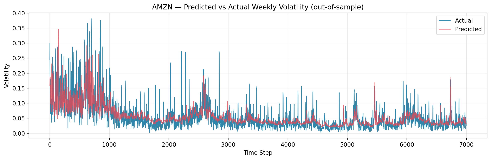

# volatility-lstm

[](https://www.python.org/downloads/)
[](LICENSE)

A stacked-LSTM model that forecasts one-week-ahead realized stock volatility from price history and the VIX, packaged as a reproducible Python project with a pre-trained model and a held-out demo.

> **Headline:** the model reduces RMSE by **20–26 %** versus a *next-week-≈-this-week* naive baseline on three sector-diverse stocks (AMZN, META, LLY) it has never seen during training.



## What this does

Trains an LSTM on daily OHLC bars from ten US equities plus the CBOE VIX index, and predicts each stock's realized weekly volatility 5 trading days into the future. The repository ships with the trained model and scalers, so cloning the repo and running the demo notebook reproduces the held-out evaluation end-to-end in under two minutes — no GPU, no retraining required.

## Approach

- **Data sources.** Daily OHLC from `yfinance` for ten training stocks (TSLA, NVDA, AAPL, MSFT, GOOGL, BRK-B, JNJ, KO, CVX, ^GSPC) plus the CBOE VIX index for market-stress context. All fetches are cached to parquet so reruns are offline-friendly.
- **Feature engineering.** Thirteen inputs total: per-stock realized volatility at three horizons (5 / 20 / 252 days, annualized via the √N rule), daily returns, intraday range, 20- and 50-day moving averages of close, plus four VIX features (level, daily change, 20-day MA, 20-day rolling std as a vol-of-vol proxy).
- **Target.** Five-trading-day-ahead realized weekly volatility (`weekly_volatility_fast.shift(-5)`).
- **Architecture.** Two stacked LSTM layers (32 units each, tanh) → dense bottleneck (16 ReLU, dropout 0.3) → linear scalar output. About 14k parameters; trains in 10–15 min on CPU.
- **Train / test methodology.** Each stock is split chronologically 80 / 10 / 10. Scalers are fit only on the first 80 % of each stock's history to prevent validation/test leakage into the feature distribution. Three additional stocks (AMZN, META, LLY) are held out entirely from training and used only for demo evaluation.
- **Baseline.** Every reported metric is compared against a naive "next week ≈ this week" predictor. The LSTM has to beat that to be worth shipping.

## Results

**Held-out stocks** (model never saw these during training):

| Ticker | LSTM RMSE | Naive RMSE | RMSE Improvement | LSTM R² |
|--------|----------:|-----------:|-----------------:|--------:|
| AMZN   |   0.03883 |    0.04897 |          +20.7 % |  +0.369 |
| META   |   0.02959 |    0.03990 |          +25.8 % |  +0.169 |
| LLY    |   0.01942 |    0.02631 |          +26.2 % |  +0.276 |

**Cross-validation** (last 10 % of each training stock, model selection via early stopping):

| Split | LSTM RMSE | Naive RMSE | RMSE Improvement | LSTM R² |
|-------|----------:|-----------:|-----------------:|--------:|
| Validation | 0.02056 | 0.02628 | +21.8 % | +0.534 |
| Test       | 0.01932 | 0.02489 | +22.4 % | +0.387 |

Numbers come from the run recorded in `models/training_metadata.json`. The demo notebook regenerates the held-out table and produces the predicted-vs-actual time series and scatter plots inline.

## How to run

**Requires Python 3.10 or newer.**

```bash
git clone https://github.com/josear678/volatility-lstm.git
cd volatility-lstm
pip install -e ".[dev]"          # editable install with dev extras
jupyter lab notebooks/demo.ipynb
```

Or, if you prefer the older flow:

```bash
pip install -r requirements.txt -r requirements-dev.txt
```

The demo loads the pre-trained model from `models/`, fetches the three held-out stocks from yfinance (cached to `data/cache/` after the first run, so subsequent runs are offline), runs inference, and renders the metrics + plots above. Runtime: under two minutes.

To retrain from scratch (~10–15 min on CPU):
```bash
python -m src.train
```

To run the unit tests (deterministic, no network):
```bash
pytest -v
```

## Project structure

```
volatility-lstm/
├── README.md
├── LICENSE
├── pyproject.toml          # PEP 517 packaging — installable via pip install -e .
├── requirements.txt        # production deps, pinned
├── requirements-dev.txt    # dev / notebook deps
├── conftest.py             # pytest path discovery
├── .github/workflows/
│   └── test.yml            # CI: runs pytest on push (Python 3.11 & 3.12)
├── src/
│   ├── config.py           # tickers, hyperparameters, paths — one source of truth
│   ├── data_loader.py      # yfinance fetching + parquet cache
│   ├── features.py         # feature engineering + windowing + chronological split
│   ├── model.py            # LSTM architecture (build_lstm)
│   ├── train.py            # Scalers (no leakage) + training loop + CLI entry
│   └── evaluate.py         # metrics + plotting helpers
├── tests/
│   ├── test_features.py    # 14 tests on the feature pipeline
│   ├── test_train.py       # tests on the no-leakage Scalers contract
│   └── test_evaluate.py    # tests on metric correctness + naive baseline
├── notebooks/
│   └── demo.ipynb          # held-out evaluation, runs in <2 min
├── docs/
│   └── amzn_predictions.png
└── models/                 # pre-trained artifacts shipped in the repo
    ├── volatility_lstm.keras
    ├── X_scaler.pkl
    ├── y_scaler.pkl
    ├── scaler_meta.json
    └── training_metadata.json
```

## Limitations and next steps

This is a research / portfolio project, not a production trading system. Things I would want to address before claiming it's deployable:

- **Survivorship bias.** Training tickers are present-day large-caps; the model has not been evaluated on names that subsequently delisted.
- **Single forecast horizon.** Only the 5-day horizon is modeled. Multi-horizon outputs and uncertainty estimates (quantile regression, MC dropout) are unaddressed.
- **VIX history begins in 1990.** Older tickers' early windows use forward-filled VIX values during the join.
- **Volatility ≠ P&L.** RMSE on realized volatility doesn't translate directly to trading returns. There is no backtest with transaction costs, slippage, or position-sizing logic in this repo.
- **No live-data evaluation.** All "held-out" results are from historical out-of-sample windows, not paper trading or live execution.

**Related work in progress:** an RL trading agent that consumes forecasts like these as part of its observation space. Will be linked here once the repository is public.
